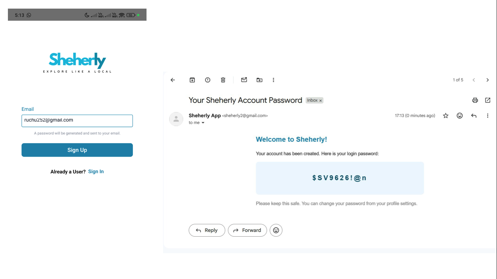

# Sheherly — Explore Like a Local 🏯

A React Native (Expo) mobile app that helps tourists and locals explore Jaipur. It covers food & dining, accommodation, transportation, medical services, local services, famous spots, safety, an AI chatbot guide, and offline bookmarking.

---

## Screenshots

<p align="center">
  
  &nbsp;
  
  &nbsp;
  
  &nbsp;
  
</p>

<p align="center">
  
  &nbsp;
  
  &nbsp;
  
  &nbsp;
  
</p>

---

## Features

- Browse food, medical, accommodation, transportation, local services, and famous spots
- AI-powered chatbot guide for Jaipur (OpenRouter / GPT-3.5)
- Interactive map with routing (OpenRouteService)
- Offline bookmarking — save any listing for offline use
- Firebase Authentication + Firestore user profiles
- Admin panel — manage users (search, filter, block/unblock, delete, role change) and manage service data

---

## Tech Stack

| Layer | Technology |
|---|---|
| Mobile App | React Native, Expo (SDK 54), Expo Router |
| Styling | NativeWind (Tailwind CSS for RN) |
| Auth & DB | Firebase Auth + Firestore |
| Admin/Data API | Node.js + Express (port 9000) |
| Map/Route API | Node.js + Express + OpenRouteService (port 8002) |
| Chatbot API | Python + FastAPI + OpenRouter (port 8001) |
| Email | Gmail via Nodemailer |

---

## Project Structure

```
Sheherly/
├── app/                    # Expo Router screens
│   ├── (auth)/             # signin, signup, forgot-password
│   ├── (tabs)/             # home, map, search, chatbot, profile, offline
│   ├── admin/              # dashboard, users, services
│   ├── category/           # food, medical, accommodation, transportation, ...
│   └── profile/            # edit, change-password, delete-account, logout
├── assets/                 # images, icons
├── backend/
│   ├── .env                # shared env file (never commit this)
│   ├── .env.example        # template — copy and fill in
│   ├── admin/              # Node.js admin + data API (port 9000)
│   │   ├── server.js
│   │   ├── routes/
│   │   ├── controllers/
│   │   └── data/           # JSON data files for all categories
│   ├── map/                # Node.js map + routing API (port 8002)
│   │   └── index.js
│   ├── chatbot/            # Python FastAPI chatbot (port 8001)
│   │   ├── chatbot.py
│   │   ├── server.py
│   │   └── jaipur_city_data.json
│   └── main.py             # FastAPI entry point
├── config.js               # Central IP/URL config — update MY_IP here
├── firebase.js             # Firebase initialization
├── hooks/                  # useOfflineCache, useNetworkStatus
└── utils/                  # authSchema, transportAdmin
```

---

## Prerequisites

- [Node.js](https://nodejs.org/) v18+
- [Python](https://www.python.org/) 3.10+
- [Expo CLI](https://docs.expo.dev/get-started/installation/) — `npm install -g expo-cli`
- [Expo Go](https://expo.dev/go) app on your Android/iOS device (or an emulator)
- A Firebase project (free Spark plan works)
- A Gmail account with an App Password enabled
- A free [OpenRouteService](https://openrouteservice.org/dev/#/signup) API key
- A free [OpenRouter](https://openrouter.ai/keys) API key

---

## Setup

### 1. Clone the repository

```bash
git clone https://github.com/your-username/sheherly.git
cd sheherly
```

### 2. Install frontend dependencies

```bash
npm install
```

### 3. Set up environment variables

```bash
cp backend/.env.example backend/.env
```

Open `backend/.env` and fill in all values. See the [Environment Variables](#environment-variables) section below.

### 4. Install backend — Admin API (Node.js)

```bash
cd backend/admin
npm install
cd ../..
```

### 5. Install backend — Map API (Node.js)

```bash
cd backend/map
npm install
cd ../..
```

### 6. Install backend — Chatbot API (Python)

```bash
cd backend
pip install fastapi uvicorn python-dotenv requests certifi
cd ..
```

Or if you have a `requirements.txt`:

```bash
cd backend
pip install -r requirements.txt
cd ..
```

### 7. Set up Firebase

1. Go to [Firebase Console](https://console.firebase.google.com/) and create a project
2. Enable **Email/Password** authentication under Authentication → Sign-in methods
3. Create a **Firestore Database** (start in test mode or set rules as needed)
4. Go to Project Settings → Your apps → Add a Web app
5. Copy the config values into `firebase.js`:

```js
const firebaseConfig = {
  apiKey: "YOUR_API_KEY",
  authDomain: "YOUR_PROJECT.firebaseapp.com",
  projectId: "YOUR_PROJECT_ID",
  storageBucket: "YOUR_PROJECT.firebasestorage.app",
  messagingSenderId: "YOUR_SENDER_ID",
  appId: "YOUR_APP_ID"
};
```

### 8. Update your local IP address

Every time you change networks, update the IP in `config.js`:

```bash
# Windows — find your IPv4 address
ipconfig
```

```js
// config.js
const MY_IP = "192.168.x.x";  // ← replace with your current IPv4
```

This is needed because Expo Go on a physical device cannot reach `localhost` — it must use your machine's local network IP.

---

## Running the App

You need **4 terminals** running simultaneously.

### Terminal 1 — Admin API (port 9000)

```bash
npm run server:admin
```

### Terminal 2 — Map API (port 8002)

```bash
npm run server:map
```

### Terminal 3 — Chatbot API (port 8001)

```bash
npm run server:chatbot
```

### Terminal 4 — Expo (React Native app)

```bash
npm start
```

Then scan the QR code with Expo Go on your phone, or press `a` for Android emulator.

---

## Environment Variables

Copy `backend/.env.example` to `backend/.env` and fill in all values.

| Variable | Description |
|---|---|
| `ADMIN_PORT` | Port for the admin/data API. Default: `9000` |
| `MAP_PORT` | Port for the map/routing API. Default: `8002` |
| `GMAIL_USER` | Gmail address used to send signup passwords to users |
| `GMAIL_APP_PASSWORD` | 16-char Gmail App Password (not your regular password). [Generate here](https://myaccount.google.com/apppasswords) |
| `ORS_API_KEY` | OpenRouteService API key for map routing. [Get here](https://openrouteservice.org/dev/#/signup) |
| `OPENROUTER_API_KEY` | OpenRouter API key for GPT-3.5 chatbot. [Get here](https://openrouter.ai/keys) |

---

## Admin Access

The admin panel is accessed via a hardcoded credential (not a Firebase user):

- Email: set in `app/(auth)/signin.jsx` as `ADMIN_EMAIL`
- Password: set in the same file as `ADMIN_PASSWORD`

Change these values before deploying. Any regular user can also be promoted to admin role via the Manage Users panel — they will be routed to the admin dashboard on next login.

---

## Firestore Data Structure

```
users/{uid}
  ├── email: string
  ├── name: string
  ├── phone: string
  ├── avatar: string
  ├── role: "user" | "admin"
  ├── isBlocked: boolean
  └── createdAt: timestamp

offlineData/{uid}/categories/{category}_{type}
  ├── data: array
  └── meta: object

savedItems/{uid}/items/{itemId}
  └── item data + meta
```

---

## Common Issues

**Network request failed on device**
→ Your `MY_IP` in `config.js` is outdated. Run `ipconfig`, copy the IPv4 address, and update the file. Restart the app.

**Chatbot not responding**
→ Make sure `npm run server:chatbot` is running and `OPENROUTER_API_KEY` is set in `backend/.env`.

**Map not loading routes**
→ Check that `npm run server:map` is running and `ORS_API_KEY` is valid.

**Signup emails not sending**
→ Verify `GMAIL_USER` and `GMAIL_APP_PASSWORD` in `.env`. Make sure 2-Step Verification is enabled on the Gmail account and the App Password is generated for "Mail".

---

## License

This project is for educational purposes.
